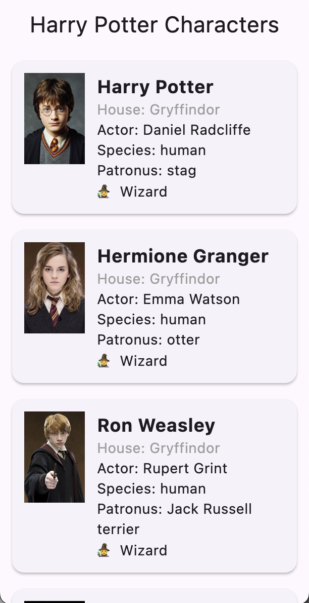
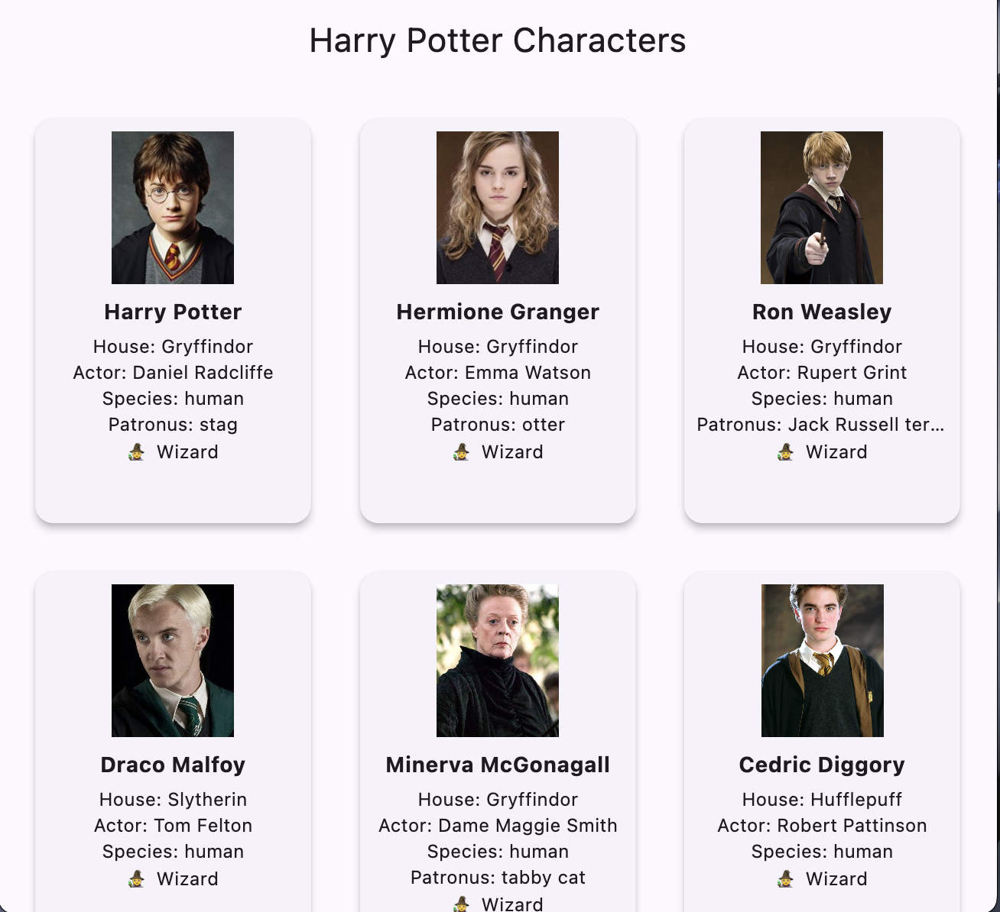

````markdown
# 🪄 Harry Potter Karakter Uygulaması

Bu Flutter uygulaması, **Harry Potter evrenine ait karakterleri** bir REST API üzerinden çekip
kullanıcıya şık bir arayüz ile sunar. Uygulama mobil ve masaüstü cihazlara duyarlı olup,
Provider ile yönetilen sade ve güçlü bir mimariye sahiptir.

---

## ✨ Özellikler

- ✅ Karakter verilerini API üzerinden dinamik olarak çeker
- ✅ Mobilde `ListView`, masaüstünde `GridView` ile duyarlı (responsive) yapı
- ✅ Hataları kullanıcıya SnackBar ile bildirir, uygulama çökmez
- ✅ `Provider` ile state yönetimi
- ✅ API isteği sırasında yükleniyor animasyonu gösterir
- ✅ Pull-to-refresh (yukarı çekerek yenileme) desteği
- ✅ `CharacterCard` ve `CharacterGridCard` gibi modüler bileşenler

---

## 🖼️ Ekran Görüntüleri

### 📱 Mobil Görünüm



### 🖥️ Masaüstü Görünüm



---

## 🚀 Kurulum

### Gereksinimler

- [Flutter SDK](https://flutter.dev/docs/get-started/install) (3.x veya üstü)
- Bir IDE (VS Code, Android Studio vb.)

### Projeyi çalıştırmak için

```bash
flutter pub get
flutter run
````

iOS için:

```bash
cd ios
pod install
cd ..
```

---

## 📁 Proje Yapısı

```text
lib/
├── core/
│   └── constant/
│       ├── api_constant.dart           # API URL sabitleri
│       └── image_constant.dart         # Varsayılan görsel URL sabitleri
│
├── data/
│   ├── models/
│   │   ├── character.dart              # Karakter modeli
│   │   └── wand.dart                   # Asa modeli
│   │
│   ├── providers/
│   │   └── character_provider.dart     # Provider (state yönetimi)
│   │
│   └── services/
│       └── api_service.dart            # API servis işlemleri
│
├── ui/
│   ├── screens/
│   │   └── character_list_screen.dart  # Ana karakter liste ekranı
│   │
│   └── widgets/
│       ├── character_grid_card.dart    # Desktop için karakter kartı
│       ├── character_images.dart       # Görsel yükleyici widget
│       └── character_list_card.dart    # Mobile için karakter kartı
│
└── main.dart                           # Uygulamanın giriş noktası
```

---

## 🌐 API Kaynağı

Veriler şu adresten alınmaktadır:
🔗 [hp-api.onrender.com/api/characters](https://hp-api.onrender.com/api/characters)

---


## 📄 Lisans

MIT © 2025 – \[Halil İbrahim KESKİN]

```
